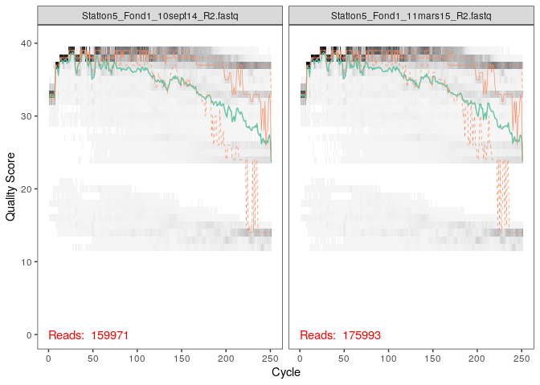
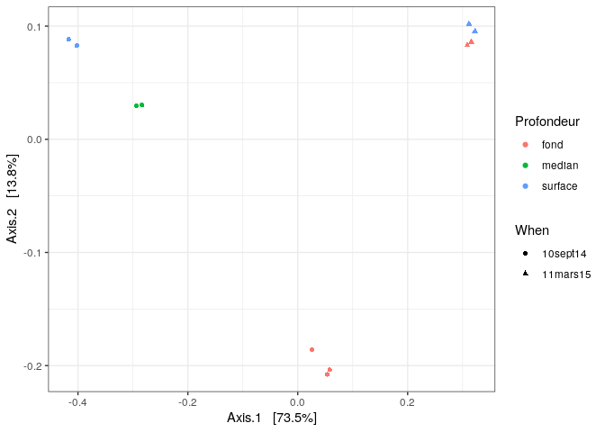
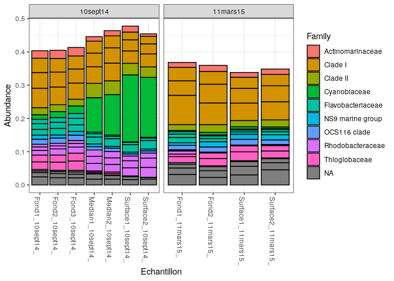

Analyses Phyloseq des données de la Rade de Brest
================

  - [Ouverture des librairies](#ouverture-des-librairies)
  - [Preparation](#preparation)
  - [Inspection du profil de qualite des
    reads](#inspection-du-profil-de-qualite-des-reads)
  - [Filtrer et couper](#filtrer-et-couper)
  - [Taux d’erreur](#taux-derreur)
  - [Interferences des echantillons](#interferences-des-echantillons)
  - [Appariment des reads
    complémentaires](#appariment-des-reads-complémentaires)
  - [Construction de la table de
    sequence](#construction-de-la-table-de-sequence)
  - [Supression des chimeres](#supression-des-chimeres)
  - [Suivie de l’affinement de notre set de donnees
    final](#suivie-de-laffinement-de-notre-set-de-donnees-final)
  - [Assignation de la taxonomie](#assignation-de-la-taxonomie)
  - [Analyses phyloseq](#analyses-phyloseq)
      - [Alpha-diversite](#alpha-diversite)
      - [Beta-diversite](#beta-diversite)
      - [Determination de biomarqueurs](#determination-de-biomarqueurs)
  - [Conclusion](#conclusion)

# Ouverture des librairies

On va ouvrir toutes les librairies qui seront necessaire au
fonctionnement de ce script et donc de nos analyses (on completera cette
partie au fur et a mesure que l’on avance dans le script).

``` r
library(knitr)
library(rmarkdown)
```

``` r
library(ggplot2)
library(phyloseq); packageVersion("phyloseq")
library(Biostrings); packageVersion("Biostrings")
```

    ## Loading required package: BiocGenerics

    ## Loading required package: parallel

    ## 
    ## Attaching package: 'BiocGenerics'

    ## The following objects are masked from 'package:parallel':
    ## 
    ##     clusterApply, clusterApplyLB, clusterCall, clusterEvalQ,
    ##     clusterExport, clusterMap, parApply, parCapply, parLapply,
    ##     parLapplyLB, parRapply, parSapply, parSapplyLB

    ## The following objects are masked from 'package:stats':
    ## 
    ##     IQR, mad, sd, var, xtabs

    ## The following objects are masked from 'package:base':
    ## 
    ##     anyDuplicated, append, as.data.frame, basename, cbind, colnames,
    ##     dirname, do.call, duplicated, eval, evalq, Filter, Find, get, grep,
    ##     grepl, intersect, is.unsorted, lapply, Map, mapply, match, mget,
    ##     order, paste, pmax, pmax.int, pmin, pmin.int, Position, rank,
    ##     rbind, Reduce, rownames, sapply, setdiff, sort, table, tapply,
    ##     union, unique, unsplit, which, which.max, which.min

    ## Loading required package: S4Vectors

    ## Loading required package: stats4

    ## 
    ## Attaching package: 'S4Vectors'

    ## The following object is masked from 'package:base':
    ## 
    ##     expand.grid

    ## Loading required package: IRanges

    ## 
    ## Attaching package: 'IRanges'

    ## The following object is masked from 'package:phyloseq':
    ## 
    ##     distance

    ## Loading required package: XVector

    ## 
    ## Attaching package: 'Biostrings'

    ## The following object is masked from 'package:base':
    ## 
    ##     strsplit

``` r
library(dada2)
```

    ## Loading required package: Rcpp

Remarque: Toutes les installations ont ete realisee dans un autre script
(CC2\_00\_install-packages) de même que l’importation des donnees
(CC2\_01\_data-import) afin de ne pas surcharger celui-ci.

# Preparation

``` r
miseq_path <- "./St_Stratif_10sept14" # CHANGE to the directory containing the fastq files after unzipping.
list.files(miseq_path)
```

``` r
# Forward and reverse fastq filenames have format: SAMPLENAME_R1_001.fastq and SAMPLENAME_R2_001.fastq
fnFs <- sort(list.files(miseq_path, pattern="_R1.fastq", full.names = TRUE))
fnRs <- sort(list.files(miseq_path, pattern="_R2.fastq", full.names = TRUE))
# Extract sample names, assuming filenames have format: SAMPLENAME_XXX.fastq
sample.names <- sapply(strsplit(basename(fnFs), "R"), `[`, 1)
```

# Inspection du profil de qualite des reads

Lorsque que l’on séquence avec Illumina, à chaque base ajoutée, on va y
associer un score de qualité ou Qscore (par exemple la chance d’avoir un
C si la base est un C) qui va évoluer au cours du séquencage.

Les fowards:

``` r
plotQualityProfile(fnFs[1:2])
```

<!-- --> Les
reverses:

``` r
plotQualityProfile(fnRs[1:2])
```

<!-- -->

On remarque que le score de qualité est plus bas dans les premiers
nucleotides. Il remonte ensuite et va de nouveau chuter au cours du
sequençage.

On va donc troncater quand le score de qualite va tomber en dessous de
30, se sera donc à la position 250 pour les forwards et à la position
200 pour les reverses On va egalement devoir retirer l’amorce presente
sur les fowards.

# Filtrer et couper

``` r
filt_path <- file.path(miseq_path, "filtered") # Place filtered files in filtered/ subdirectory
if(!file_test("-d", filt_path)) dir.create(filt_path)
filtFs <- file.path(filt_path, "filtered", paste0(sample.names, "_Ffilt.fastq.gz"))
filtRs <- file.path(filt_path, "filtered", paste0(sample.names, "_Rfilt.fastq.gz"))
names(filtFs) <- sample.names
names(filtRs) <- sample.names
```

``` r
out <- filterAndTrim(fnFs, filtFs, fnRs, filtRs, truncLen=c(250,200), trimLeft =21,
              maxN=0, maxEE=c(2,2), truncQ=2, rm.phix=TRUE,
              compress=TRUE, multithread=TRUE)
head(out)
```

# Taux d’erreur

``` r
errF <- learnErrors(filtFs, multithread=TRUE)
```

    ## 110221135 total bases in 481315 reads from 3 samples will be used for learning the error rates.

``` r
errR <- learnErrors(filtRs, multithread=TRUE)
```

    ## 100420969 total bases in 561011 reads from 4 samples will be used for learning the error rates.

``` r
plotErrors(errF, nominalQ=TRUE)
```

    ## Warning: Transformation introduced infinite values in continuous y-axis
    
    ## Warning: Transformation introduced infinite values in continuous y-axis

<!-- -->

# Interferences des echantillons

``` r
dadaFs <- dada(filtFs, err=errF, multithread=TRUE)
```

``` r
dadaRs <- dada(filtRs, err=errR, multithread=TRUE)
```

# Appariment des reads complémentaires

On va apparier les fowards avec leur reverses complementaires. Si nous
n’avons pas de correspondence parfaite, ils seront retires des
donnees.

``` r
mergers <- mergePairs(dadaFs, filtFs, dadaRs, filtRs, verbose=TRUE)
```

    ## 115473 paired-reads (in 4595 unique pairings) successfully merged out of 140326 (in 21160 pairings) input.

    ## 136539 paired-reads (in 3685 unique pairings) successfully merged out of 155618 (in 15520 pairings) input.

    ## 139935 paired-reads (in 6236 unique pairings) successfully merged out of 170590 (in 26605 pairings) input.

    ## 66207 paired-reads (in 2312 unique pairings) successfully merged out of 77396 (in 9469 pairings) input.

    ## 82090 paired-reads (in 3117 unique pairings) successfully merged out of 101553 (in 16083 pairings) input.

    ## 85833 paired-reads (in 3244 unique pairings) successfully merged out of 102767 (in 13959 pairings) input.

    ## 80200 paired-reads (in 2622 unique pairings) successfully merged out of 95148 (in 12056 pairings) input.

    ## 89039 paired-reads (in 3012 unique pairings) successfully merged out of 103729 (in 11950 pairings) input.

    ## 58701 paired-reads (in 1682 unique pairings) successfully merged out of 68495 (in 7924 pairings) input.

    ## 65924 paired-reads (in 1731 unique pairings) successfully merged out of 76263 (in 8159 pairings) input.

    ## 73150 paired-reads (in 2621 unique pairings) successfully merged out of 87831 (in 11884 pairings) input.

``` r
# Inspect the merger data.frame from the first sample
head(mergers[[1]])
```

# Construction de la table de sequence

On prepare la table.

``` r
seqtab <- makeSequenceTable(mergers)
dim(seqtab)
```

    ## [1]    11 17389

``` r
# Inspect distribution of sequence lengths
table(nchar(getSequences(seqtab)))
```

    ## 
    ##  352  353  362  363  364  365  366  367  368  369  370  371  372  373  374  375 
    ##    1    1    1    1    4  187   23  161  170 4913 3125 2167 2285 2492  101 1651 
    ##  376  377  378  382  386  387  389  392 
    ##   91    4    1    1    2    1    1    5

La premiere ligne donne la taille des sequences, la deuxieme donne le
nombre de sequence presentant cette taille.

# Supression des chimeres

``` r
seqtab.nochim <- removeBimeraDenovo(seqtab, method="consensus", multithread=TRUE, verbose=TRUE)
```

    ## Identified 15867 bimeras out of 17389 input sequences.

``` r
dim(seqtab.nochim)
```

``` r
sum(seqtab.nochim)/sum(seqtab)
```

    ## [1] 0.7840742

# Suivie de l’affinement de notre set de donnees final

On va suivre a chaque etape le nombre de sequence qui n’ont pas ete
filtre et donc retire de notre set de donnees. On fait un suivi du
traitement des données.

``` r
getN <- function(x) sum(getUniques(x))
track <- cbind(out, sapply(dadaFs, getN), sapply(dadaRs, getN), sapply(mergers, getN), rowSums(seqtab.nochim))
# If processing a single sample, remove the sapply calls: e.g. replace sapply(dadaFs, getN) with getN(dadaFs)
colnames(track) <- c("input", "filtered", "denoisedF", "denoisedR", "merged", "nonchim")
rownames(track) <- sample.names
head(track)
```

    ##                             input filtered denoisedF denoisedR merged nonchim
    ## Station5_Fond1_10sept14_   159971   145031    142239    142879 115473   87651
    ## Station5_Fond1_11mars15_   175993   159807    157275    157884 136539  110945
    ## Station5_Fond2_10sept14_   197039   176477    172714    174073 139935  103398
    ## Station5_Fond2_11mars15_    87585    79696     78289     78639  66207   54402
    ## Station5_Fond3_10sept14_   117140   105805    103125    104001  82090   63805
    ## Station5_Median1_10sept14_ 116519   106244    104130    104717  85833   65324

# Assignation de la taxonomie

``` bash
wget https://zenodo.org/record/3986799/files/silva_nr99_v138_train_set.fa.gz?download=1
```

``` r
taxa <- assignTaxonomy(seqtab.nochim,"~/silva_nr99_v138_train_set.fa.gz?download=1", multithread = TRUE)
```

``` r
taxa <- addSpecies(taxa, "~/silva_species_assignment_v138.fa.gz?download=1")
```

``` r
taxa.print <- taxa # Removing sequence rownames for display only
rownames(taxa.print) <- NULL
head(taxa.print)
```

    ##      Kingdom    Phylum             Class                 Order            
    ## [1,] "Bacteria" "Proteobacteria"   "Alphaproteobacteria" "SAR11 clade"    
    ## [2,] "Bacteria" "Cyanobacteria"    "Cyanobacteriia"      "Synechococcales"
    ## [3,] "Bacteria" "Proteobacteria"   "Alphaproteobacteria" "SAR11 clade"    
    ## [4,] "Bacteria" "Proteobacteria"   "Alphaproteobacteria" "SAR11 clade"    
    ## [5,] "Bacteria" "Proteobacteria"   "Alphaproteobacteria" "SAR11 clade"    
    ## [6,] "Bacteria" "Actinobacteriota" "Acidimicrobiia"      "Actinomarinales"
    ##      Family             Genus                     Species
    ## [1,] "Clade I"          "Clade Ia"                NA     
    ## [2,] "Cyanobiaceae"     "Synechococcus CC9902"    NA     
    ## [3,] "Clade I"          "Clade Ia"                NA     
    ## [4,] "Clade I"          "Clade Ia"                NA     
    ## [5,] "Clade II"         NA                        NA     
    ## [6,] "Actinomarinaceae" "Candidatus Actinomarina" NA

# Analyses phyloseq

## Alpha-diversite

``` r
theme_set(theme_bw())
```

``` r
samples.out <- rownames(seqtab.nochim)
subject <- samples.out
echantillon <- substr(subject,10,30)
subject <- substr(subject,10,30)
samples.out2 <- samples.out
samples.out2[c(1, 3, 5, 6, 7, 8, 10)] <- 2014
samples.out2[c(2, 4, 9, 11)] <- 2015
samples.out3 <- samples.out
samples.out3[c(1, 3, 5, 2, 4)] <- "fond"
samples.out3[c(6, 7)] <- "median"
samples.out3[c(8, 9, 10, 11)] <- "surface"
profondeur <- samples.out3
year <- as.integer(samples.out2)
samdf <- data.frame(Subject=subject, Echantillon=echantillon, Year=year, Profondeur=profondeur)
samdf$When <- "10sept14"
samdf$When[samdf$Year == "2015"] <- "11mars15"
rownames(samdf) <- samples.out
```

``` r
ps <- phyloseq(otu_table(seqtab.nochim, taxa_are_rows=FALSE), 
               sample_data(samdf), 
               tax_table(taxa))
ps <- prune_samples(sample_names(ps) != "Mock", ps) # Remove mock sample
```

``` r
dna <- Biostrings::DNAStringSet(taxa_names(ps))
names(dna) <- taxa_names(ps)
ps <- merge_phyloseq(ps, dna)
taxa_names(ps) <- paste0("ASV", seq(ntaxa(ps)))
ps
```

    ## phyloseq-class experiment-level object
    ## otu_table()   OTU Table:         [ 1522 taxa and 11 samples ]
    ## sample_data() Sample Data:       [ 11 samples by 5 sample variables ]
    ## tax_table()   Taxonomy Table:    [ 1522 taxa by 7 taxonomic ranks ]
    ## refseq()      DNAStringSet:      [ 1522 reference sequences ]

On va calculer des indices d’alpha diversite: Shannon et Simpson.

``` r
plot_richness(ps, x="Echantillon", measures=c("Shannon", "Simpson"), color="When")
```

<!-- -->

L’indice de Shannon, comme l’indice de Simpson, va nous donner des
informations sur la diversite au sein de nos donnees, mais il va
egalement inclure un facteur d’abondance.

A la vu de ces deux graphes, on remarque que les deux indices suivent un
meme paterne. De plus, si ils restent approximativement constant a la
fin de l’hiver, on remarque qu’il vont grandement varier en fonction de
la profondeur a la fin de l’ete, avec des indices d’alpha diversite qui
vont evoluer inversement a la profondeur. Il doit donc avoir un effet de
la saisonalite sur la diversite presente dans cette zone (la Rade de
Brest).

On peut egalement le faire en fonction de la profondeur pour preciser
une veritable image de la diversite en fonction de ce facteur.

``` r
plot_richness(ps, x="Profondeur", measures=c("Shannon", "Simpson"), color="When")
```

<!-- --> Les
differences observes precedement, en fonction de la profondeur, sont
encore plus flagrantes ici.

## Beta-diversite

On va maitenant faire une pCoA (indice de beta diversite). Les points
vont êtres places les uns en fonction des autres. On ajoute donc des
relations.

``` r
pslog <- transform_sample_counts(ps, function(x) log(1 + x))
out.wuf.log <- ordinate(pslog, method = "PCoA", distance = "bray")
```

``` r
evals <- out.wuf.log$values$Eigenvalues
plot_ordination(pslog, out.wuf.log, color = "Profondeur", shape="When") +
labs(col = "Profondeur",shape= "When") 
```

<!-- -->

On remarque la presence de plusieurs cluster et donc de groupes avec des
similarites (points rapproches les uns des autres).

Ces resultats confirment une certaine saisonnalite car si les donnees
issues du prelevement a la fin de l’hiver se rassemble au sein d’un même
cluster, peu importe la profondeur, c’est autre chose pour celle datant
de la fin de l’ete. On retrouve pour ces dernieres 3 clusters
differents, avec celui de la profondeur mediane se rapprochant plus de
celle du fond que de celle de la surface.

Il y aurai donc bien une influence de facteurs issus de la saisonnalite
sur la diversite des populations (certainement des facteurs
environnementaux tels que la temperature ou le rayonnement UV).

## Determination de biomarqueurs

Un biomarqueur est une caracteristique biologique mesurable. Il va nous
servir afin de detecter des changements ou evolutions au sein d’un
milieu.

``` r
top20 <- names(sort(taxa_sums(ps), decreasing=TRUE))[1:20]
ps.top20 <- transform_sample_counts(ps, function(OTU) OTU/sum(OTU))
ps.top20 <- prune_taxa(top20, ps.top20)
plot_bar(ps.top20, x="Echantillon", fill="Family") + facet_wrap(~When, scales="free_x")
```

<!-- -->

Les clades I et II sont constant au cours du temps et de la profondeur,
ils ne sont donc pas impactes par les facteurs environnementaux decrit
precedemment. Par contre, les Cyanoblaceae et les Thioglobaceae sont
grandement impactes par ces changements. Ils vont respectivement voir
leur abondance augmenter ou baisser en ete et inversement en hiver. Se
sont donc des marqueurs de ce changement de conditions entre les deux
saisons.

On remarque de plus une similarite entre le fond en ete et toutes les
profondeurs en hiver.

``` r
top20 <- names(sort(taxa_sums(ps), decreasing=TRUE))[1:20]
ps.top20 <- transform_sample_counts(ps, function(OTU) OTU/sum(OTU))
ps.top20 <- prune_taxa(top20, ps.top20)
plot_bar(ps.top20, x="Echantillon", fill="Genus") + facet_wrap(~When, scales="free_x")
```

<!-- -->

On peut voir que si certains genres sont constants entre fin ete et fin
hiver, comme Clade Ia, NS4 marine group ou dans une certaine proportion
Candidatus Actinomarina. D’autres ne sont présents, ou du moins dans une
grande abondance qu’au cours de l’ete. C’est notamment le cas de
Synechococcus CC9902 ou Ascidiacethabitans.

Synechococcus CC9902 peut donc être un bon marqueur du passage d’une
saison a une autre. Clade Ia est lui tout le temps present que se soit
en profondeur ou en saison, on peut donc l’utiliser comme marqueur afin
de detecter des changements dans le milieu, tel qu’une pollution par
exemple, mais pour cela, il faudrai etudier son comportement en fonction
de facteurs de pollution par exemple.

On confirme egalement la ressemblance entre l’abondance dans les fonds
en ete et a toutes les profondeurs en hiver. On peut donc dire que
seules les couches medianes et de surfaces vont avoir des changements au
cours de l’annee, et donc sous l’influence des facteurs
environnemmentaux dus a la saisonnalite.

# Conclusion

Au sein de la Rade de Brest, on peut observer une saisonalite de la
diversite. Si en profondeur, les variations environnementales en
fonction des saisons ne se font pas tellement resentir, c’est different
en surface où la variation de facteurs tels que surement le rayonnement
UV ou la temperature ont un impact.

Afin de completer l’etude, on aurai pu aquerir d’autres donnes, tels que
les mesure de temperature et de rayonnement justement afin de confirmer
le potentiel impact sur la diversite. Il aurai egalement ete plus
pertinant de donne des precision sur la profondeur de l’echantillonnage
(en metre) afin de pourvoir les corroler avec les autres facteurs plus
precisement.
